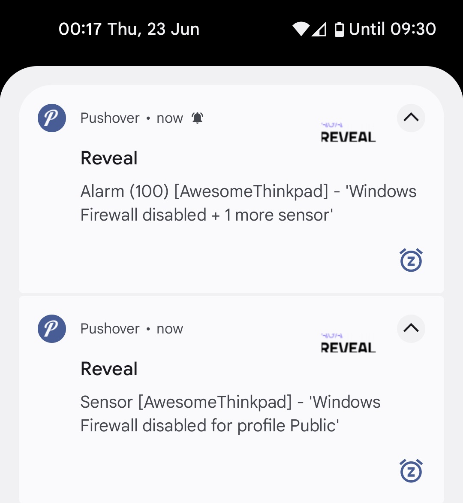

# Reveal2Pushover

A very simple Golang Server to convert Reveal Webhooks to [Pushover](https://pushover.net) notifications. Really handy to get notifications on your phone when a sensor has fired.

## Note

This is a personal project, it is provided with No warranty and is not endorsed by Qush or provided as an "official" product.
